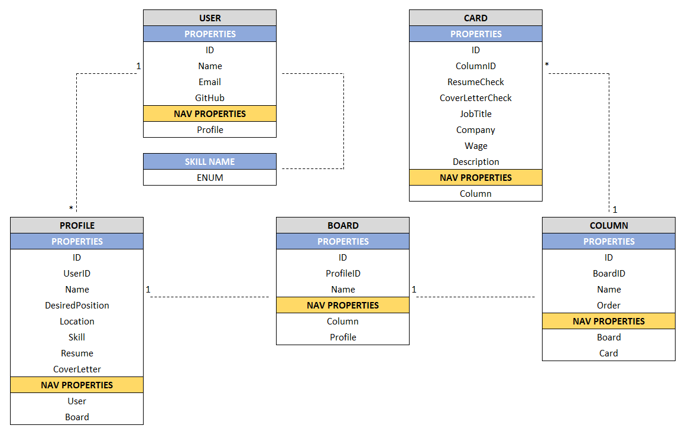
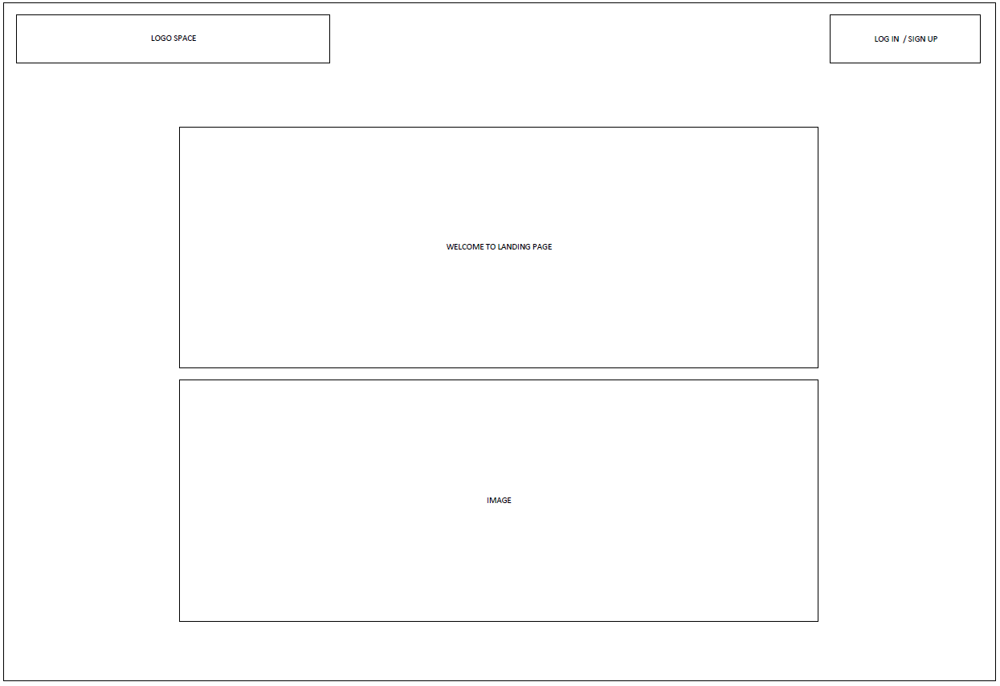
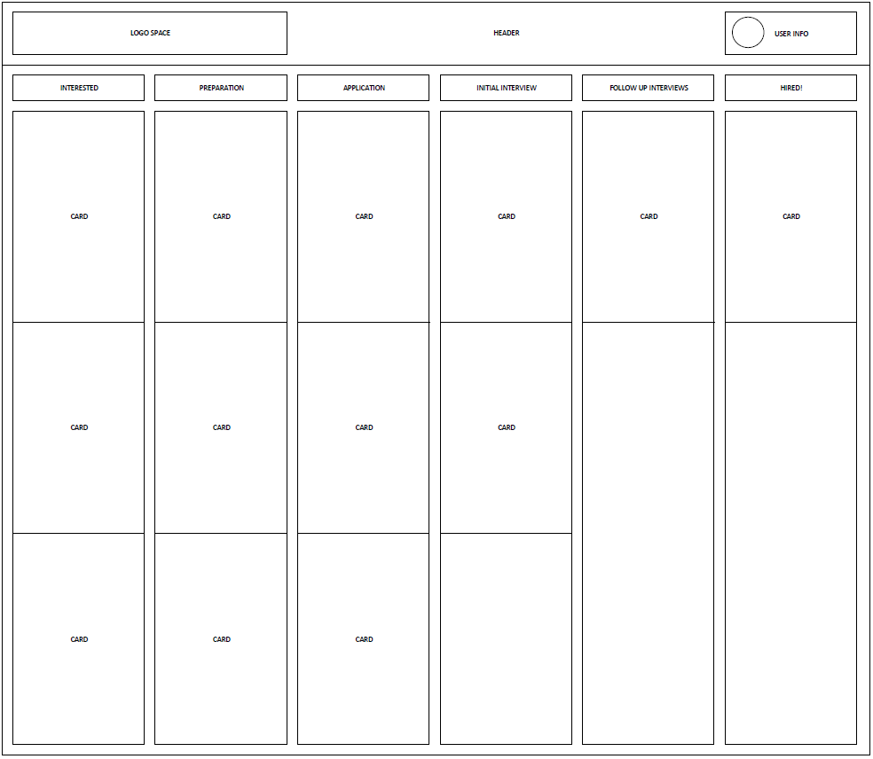
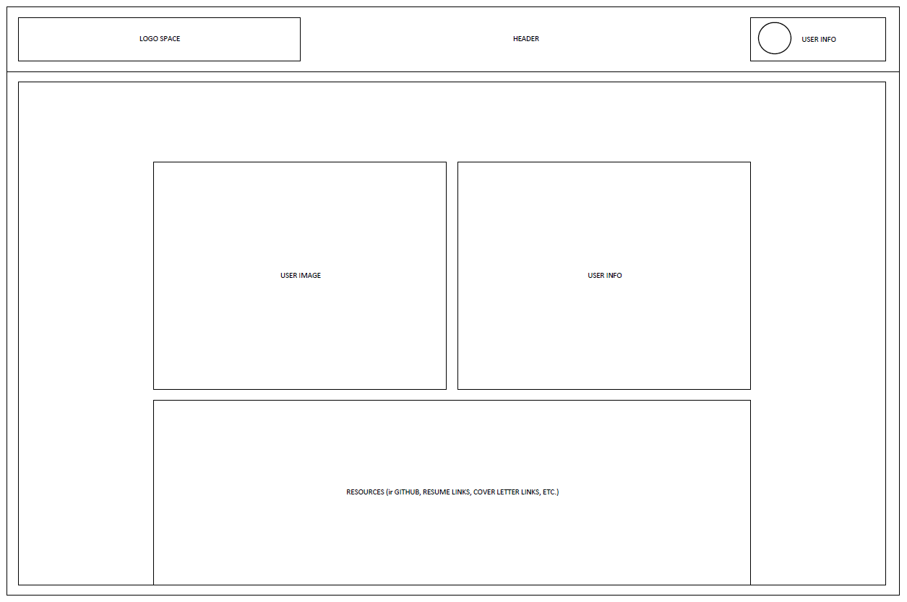
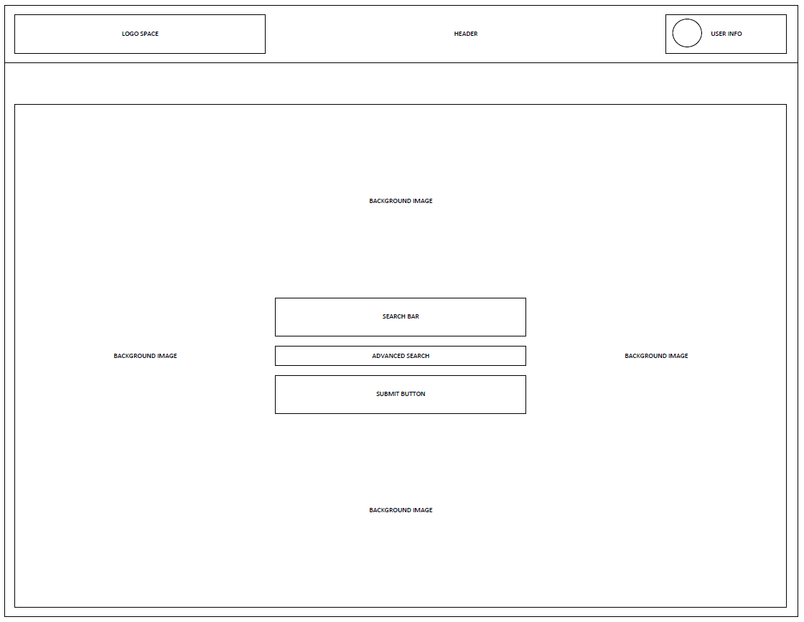
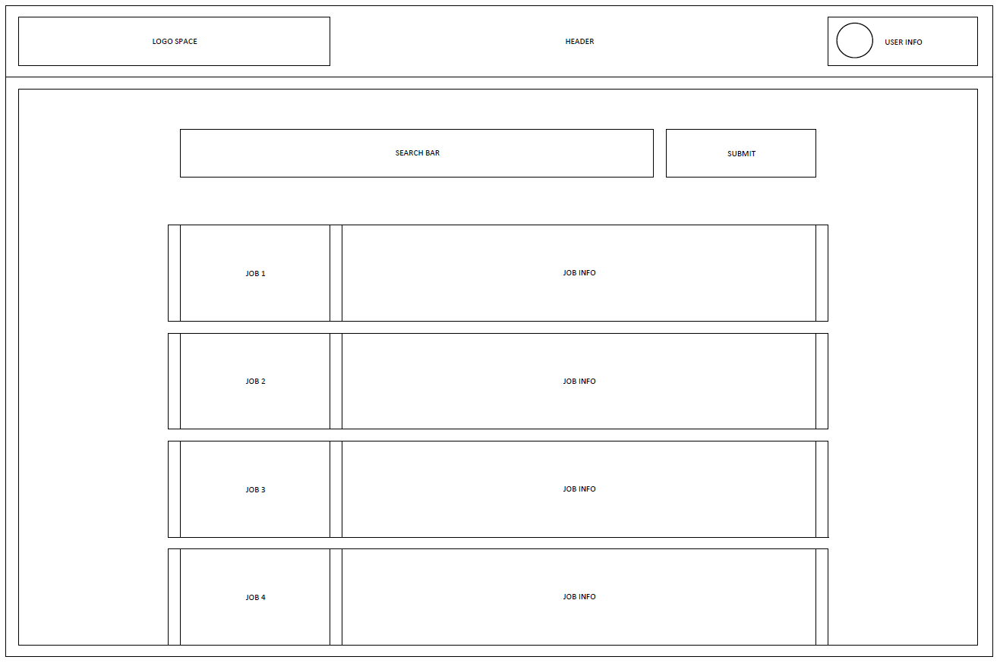
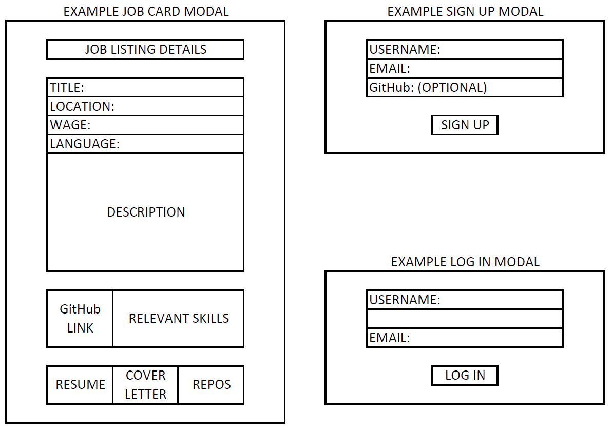

# GitHired-MVC
C# MVC web application that allows users to manage the job search process using a can-ban board

## GitHired Team Members: Richard Flinn Mike Filicetti, Xia Liu, Julie Ly, Sean Miller

### Group KanBan: https://waffle.io/githired-team/GitHired-API

## Models
We wanted our can-ban board to be comprised of several objects rather than a single object with predefined boundries. In doing so we allowed ourselves the structure for growth, in the sense that if the user wanted to add columns to their board or to give us the ability to add more components to the board later on. We have models based on a root object for the API call for job postings. The API for our site is [API/GetJobs](https://githiredapi.azurewebsites.net/api/GetJobs). With the following models we can make a board.

## Database Schema

- Table User: This table will contain the details of a user
- Table Card: This table will contain the information of the job one is interested in (it will be utilized heavily on the main display page)
- Table Profile: This table will contain the details of one's job search (like what kind of job they are looking for, what area they are searching, etc)
- Table Board: This table will contain the items that pull together all the information, like what jobs one would like to apply to (or have applied to, etc) for which job search type, etc
- Table Column: This table will contain the status/progress of the CARD

#### Board Model
```c#
public class Board
    {
        public int ID { get; set; }
        public int FocusID { get; set; }

        [Required(ErrorMessage = "Please provide a name for this board")]
        [Display(Name = "Board Name")]
        public string Name { get; set; }

        public ICollection<Column> Column { get; set; }
        public Focus Focus { get; set; }
    }
```

#### Column Model
```c#
public class Board
    public class Column
    {
        public int ID { get; set; }
        public int BoardID { get; set; }
        public string Name { get; set; }
        public int Order { get; set; }
        
        public ICollection<Card> Card { get; set; }
        public Board Board { get; set; }
    }
```

#### Card Model
```c#
public class Board
    public class Card
    {
        public int ID { get; set; }
        public int ColumnID { get; set; }
        public bool ResumeCheck { get; set; }
        public bool CoverLetterCheck { get; set; }
        public string JobTitle { get; set; }
        public string CompanyName { get; set; }
        public string Wage { get; set; }
        public string Description { get; set; }

        public Column Column { get; set; }
        public Focus Focus { get; set; } 
    }
```

The next following models are structures for the User and their profile. This profile, we call focus, represents the field the user whiches to associate job searchs with. As developers an example of this would be "Back-End Development"

#### User Model
```c#
public class Board
    public class User
    {
        public int ID { get; set; }
        public string Name { get; set; }
        public string Email { get; set; }
        public string GitHubLink { get; set; }
        public string Avatar { get; set; }
        public ICollection<Focus> Focus { get; set; }
    }
```


#### Focus Model
```c#
public class Board
    public class Focus
    {
        public int ID { get; set; }
        public int UserID { get; set; }

        [Required(ErrorMessage = "Please provide a name for this focus")]
        [Display(Name = "Focus Name")]
        public string Name { get; set; }
        public string DesiredPosition { get; set; }
        public string Location { get; set; }
        public string Skill { get; set; }
        public string ResumeLink { get; set; }
        public string CoverLetter { get; set; }
        public string GHLink1 { get; set; }
        public string GHLink2 { get; set; }
        public string GHLink3 { get; set; }

        public User User { get; set; }
        public Board Board { get; set; }
    }
```
 
## View Models

Our application currently uses two view models in order to hold the state of the application for a given page. We managed a lot of this with Microsoft.AspNetCore.Http.CookieOption by saving a cookie associated with the user's session. The following two view models were used to manage the user and their focus & a job from the search with the card model to add to the user's board.

### Focus/User View Model
```c#
 public class FocusViewModel
    {
        public Focus Focus { get; set; }
        public int UserID { get; set; }
    }
```

### Job/Card View Model
```c#
public class SearchViewModel
    {
        public List<JobPosting> JobPostings { get; set; }
        public Card Card { get; set; }

        public SearchViewModel(List<JobPosting> jobPostings)
        {
            JobPostings = jobPostings;
        }
    }
```
-----------------------------
## Controllers
The controllers are the driving force behind the MVC architecture. They determine the actions of objects and how those objects interact with the database as well as the rendering of the view. By default these actions are (CRUD) Create/Read/Update/Delete. Not all models in our application require the need for full CRUD but each one uses some/all of the CRUD operations

### Board Controller
The board controller has one responsibility, when called render the board object.

```c#
public async Task<IActionResult> Index(int? id)
        {
            if (Request.Cookies["FocusCookie"] != null)
            {
                id = Convert.ToInt32(Request.Cookies["FocusCookie"]);
            }
            else if (id != null)
            {
                Response.Cookies.Append("FocusCookie", id.ToString());
            }
            else
                return NotFound();

            Board board = await _board.GetBoardAsync((int)id);
            return View(board);
        }
```

### Card Controller
The card controller follows the CRUD operations as well as the action to move left and right. The Create action and the Move actions are notable because they have to find out more about the environmnent in order to fire correctly.

#### Create Card
```c#
[HttpPost]
public async Task<IActionResult> Create([Bind("ID,ColumnID,ResumeCheck,CoverLetterCheck,JobTitle,CompanyName,Wage,Description,GHLink1,GHLink2,GHLink3")] Card card)
        {
            int focusID = Convert.ToInt32(Request.Cookies["FocusCookie"]);
            
            int boardID = await _context.Board.Where(b => b.FocusID == focusID)
                                              .Select(b => b.ID)
                                              .FirstOrDefaultAsync();

            card.ColumnID = await _context.Column.Where(c => c.BoardID == boardID)
                                                  .Where(c => c.Order == 1)
                                                  .Select(c => c.ID)
                                                  .FirstOrDefaultAsync();


            card.Focus = await _context.Focus.Where(f => f.ID == focusID).FirstOrDefaultAsync();

            
            if (card.Focus.ResumeLink != null)
            {
                card.ResumeCheck = true;
            }
            else
            {
                card.ResumeCheck = false;
            }

            if (card.Focus.CoverLetter != null)
            {
                card.CoverLetterCheck = true;
            }
            else
            {
                card.CoverLetterCheck = false;
            }

            await _card.CreateCard(card);
            return RedirectToAction("Index", "Board");
        }
```

#### Move Action
In order to move a card to a new column, the card needs to know more about the baord it is associated with and thus can find all the columns associated with the board. This gives a wider scope than simply knowing only about the column it exists in. 

```c#
[HttpPost]
public async Task<IActionResult> MoveCardLeft(int id)
        {
            int focusID = Convert.ToInt32(Request.Cookies["FocusCookie"]);
            Board board = await _context.Board.Where(b => b.FocusID == focusID)
                                        .Include(b => b.Column)
                                        .FirstOrDefaultAsync();


            Card card = await _context.Card.Where(c => c.ID == id)
                                            .Include(c => c.Column)
                                            .FirstOrDefaultAsync();

            int desiredColumnOrder = card.Column.Order - 1;

            int? desiredColumnID = board.Column.Where(c => c.Order == desiredColumnOrder)
                                              .Select(c => c.ID)
                                              .First();
            if (desiredColumnID != null)
            {
                card.ColumnID = (int)desiredColumnID;
                await _card.UpdateCard(card);
            }
            return RedirectToAction("Index", "Board");
        }
```

### Focus Controller

The focus controller exists to to manage the profile a user wants to associate to a board, it follows a CRUD operation design. This focus has a dashboard associated to a user where they can pick a focus and view the board associated to it. The user can also create/edit/delete a focus on their dashboard. When a user creates a focus we want them to immediately have access to a board and so we use the power of the controller to create a board object after the creation of the new focus in the databse. In order for a baord to be complete it must have the four default column objects, those too are created in this action.

#### Create
```c#
[HttpPost]
public async Task<IActionResult> Create([Bind("UserID, Name, DesiredPosition, Location, Skill, ResumeLink, CoverLetter")] Focus focus)
        {
            if (ModelState.IsValid)
            {
                await _focus.CreateFocus(focus);
                Board newBoard = new Board();
                newBoard.Name = focus.Name;
                newBoard.FocusID = focus.ID;
                await _board.CreateBoard(newBoard);

                Column newDefaultColInterested = new Column();
                newDefaultColInterested.BoardID = newBoard.ID;
                newDefaultColInterested.Name = "Interested";
                newDefaultColInterested.Order = 1;

                Column newDefaultColWIP = new Column();
                newDefaultColWIP.BoardID = newBoard.ID;
                newDefaultColWIP.Name = "Application";
                newDefaultColWIP.Order = 2;

                Column newDefaultColComplete = new Column();
                newDefaultColComplete.BoardID = newBoard.ID;
                newDefaultColComplete.Name = "Submitted";
                newDefaultColComplete.Order = 3;

                Column newDefaultColInterview = new Column();
                newDefaultColInterview.BoardID = newBoard.ID;
                newDefaultColInterview.Name = "Interview";
                newDefaultColInterview.Order = 4;

                await _column.CreateColumn(newDefaultColInterested);
                await _column.CreateColumn(newDefaultColWIP);
                await _column.CreateColumn(newDefaultColComplete);
                await _column.CreateColumn(newDefaultColInterview);
                return RedirectToAction(nameof(Index), focus);
            }
            return RedirectToAction(nameof(Index), focus);

        }
```
### Search controller
The search controller has one purpose and that is to call the API for job listings and create an object to hand off to the view. There is error handling for a call that does not come back correctly.

```c#
[HttpPost] 
public async Task<IActionResult> Index(string query)
        {
            using (HttpClient client = new HttpClient())
            {
                try
                {
                    string path = QueryHelpers.AddQueryString("https://githiredapi.azurewebsites.net/api/GetJobs", "query", query);
                    HttpResponseMessage response = await client.GetAsync(path);

                    if (response.IsSuccessStatusCode)
                    {
                        string jobsJSON = await response.Content.ReadAsStringAsync();
                        RootObject results = JsonConvert.DeserializeObject<RootObject>(jobsJSON);
                        SearchViewModel model = new SearchViewModel(results.jobs);
                        return View(model);

                    } else
                    {
                        // TODO: add "something went wrong" page
                        Console.WriteLine("API Broke :(((");
                        return RedirectToAction("Index", "Board");
                    }
                } catch (Exception e) 
                {
                    Console.WriteLine(e.Message);
                    return RedirectToAction("Index", "Board");
                }
            }
        }
```

### User Controller
The user controller adds new users to the database as well as manages their session after login. The User contorller sets the Cookie Option "GitHiredCookie" in the browser. The application uses this cookie to maintain the state of the user's session as they navigate through the application.

```c#
public async Task<IActionResult> Login(string name)
        {
            User user = await _user.GetUserByName(name);


            CookieOptions cookie = new CookieOptions();
            cookie.Expires = DateTime.Now.AddHours(1);
            Response.Cookies.Append("GitHiredCookie", user.ID.ToString());


            return RedirectToAction("Index");
        }
```
----------------------------------------------

## Views
Visit our website at [GitHired](https://githired-mvc.azurewebsites.net/)

## Wire Frames
These were the concepts we began this process with:

#### Landing View


#### GitHired Kanban View


#### Profile View


#### Search View


#### Search Results View


#### Example Modals

