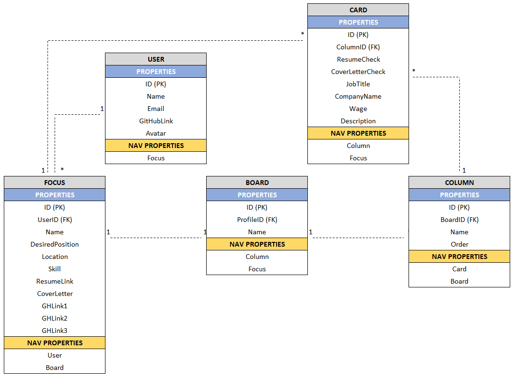

# GitHired-MVC
C# MVC web application that allows users to manage the job search process

## 
Database Schema

## Wire Frames
### Landing View

### Kanban View

### Profile View

### Search View

### Search Results View

### Example Modals

